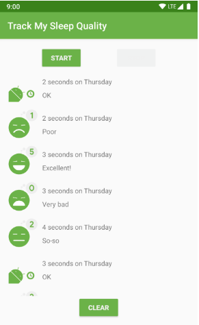
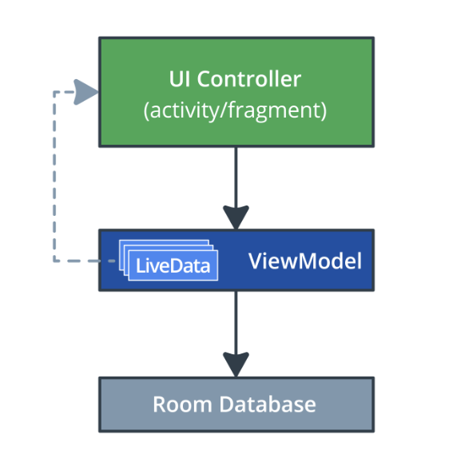
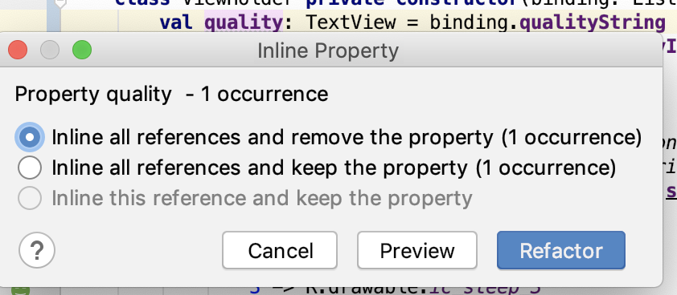

--- 
available_flavours:
- kotlin
content_type: project
prerequisites:
  hard:
  - projects/kotlin/project-7/recyclerview-fundamentals
  soft: []
ready: true
submission_type: repo
title: Diffutil Data Binding with Recycler-View.
---

### App overview
The sleep-tracker app has two screens, represented by fragments, as shown in the figure below.




The first screen, shown on the left, has buttons for starting and stopping tracking. The screen shows some of the user's sleep data. The Clear button permanently deletes all the data that the app has collected for the user. The second screen, shown on the right, is for selecting a sleep-quality rating.

This app is architected to use a UI controller, ViewModel and LiveData, and a Room database to persist sleep data.



The sleep data is displayed in a RecyclerView. In this project, you build the DiffUtil and data-binding portion for the RecyclerView. After this project, your app will look exactly the same, but it will be more efficient and easier to scale and maintain.


### Task: Get started and review what you have so far

You can continue using the SleepTracker app from the previous project.

-Run the app.
- Open the SleepNightAdapter.kt file.
- Inspect the code to familiarize yourself with the structure of the app. Refer to the diagram below for a recap of using RecyclerView with the adapter pattern to display sleep data to the user.


- From user input, the app creates a list of SleepNight objects. Each SleepNight object represents a single night of sleep, its duration, and quality.
- The SleepNightAdapter adapts the list of SleepNight objects into something RecyclerView can use and display.
- The SleepNightAdapter adapter produces ViewHolders that contain the views, data, and meta information for the recycler view to display the data.
- RecyclerView uses the SleepNightAdapter to determine how many items there are to display (getItemCount()). RecyclerView uses onCreateViewHolder() and onBindViewHolder() to get view holders bound to data for displaying.

### The notifyDataSetChanged() method is inefficient
To tell RecyclerView that an item in the list has changed and needs to be updated, the current code calls notifyDataSetChanged() in the SleepNightAdapter, as shown below.

```
var data =  listOf<SleepNight>()
   set(value) {
       field = value
       notifyDataSetChanged()
   }
```

However, `notifyDataSetChanged()` tells RecyclerView that the entire list is potentially invalid. As a result, RecyclerView rebinds and redraws every item in the list, including items that are not visible on screen. This is a lot of unnecessary work. For large or complex lists, this process could take long enough that the display flickers or stutters as the user scrolls through the list.

To fix this problem, you can tell RecyclerView exactly what has changed. RecyclerView can then update only the views that changed on screen.

RecyclerView has a rich API for updating a single element. You could use notifyItemChanged() to tell RecyclerView that an item has changed, and you could use similar functions for items that are added, removed, or moved. You could do it all manually, but that task would be non-trivial and might involve quite a bit of code.

Fortunately, there's a better way.

#### DiffUtil is efficient and does the hard work for you

RecyclerView has a class called DiffUtil which is for calculating the differences between two lists. DiffUtil takes an old list and a new list and figures out what's different. It finds items that were added, removed, or changed. Then it uses an algorithm called a Eugene W. Myers's difference algorithm to figure out the minimum number of changes to make from the old list to produce the new list.

Once DiffUtil figures out what has changed, RecyclerView can use that information to update only the items that were changed, added, removed, or moved, which is much more efficient than redoing the entire list.


### Task: Refresh list content with DiffUtil

In this task, you upgrade the SleepNightAdapter to use DiffUtil to optimize the RecyclerView for changes to the data.

#### Step 1: Implement SleepNightDiffCallback

In order to use the functionality of the DiffUtil class, extend DiffUtil.ItemCallback.

- Open SleepNightAdapter.kt.
- Below the full class definition for SleepNightAdapter, make a new top-level class called SleepNightDiffCallback that extends DiffUtil.ItemCallback. Pass SleepNight as a generic parameter.

```
class SleepNightDiffCallback : DiffUtil.ItemCallback<SleepNight>() {
}
```

- Put the cursor in the SleepNightDiffCallback class name.
- Press Alt+Enter (Option+Enter on Mac) and select Implement Members.
- In the dialog that opens, shift-left-click to select the areItemsTheSame() and areContentsTheSame() methods, then click OK.

This generates stubs inside SleepNightDiffCallback for the two methods, as shown below. DiffUtil uses these two methods to figure out how the list and items have changed.

```
    override fun areItemsTheSame(oldItem: SleepNight, newItem: SleepNight): Boolean {
        TODO("not implemented") //To change body of created functions use File | Settings | File Templates.
    }

    override fun areContentsTheSame(oldItem: SleepNight, newItem: SleepNight): Boolean {
        TODO("not implemented") //To change body of created functions use File | Settings | File Templates.
    }
```

- Inside `areItemsTheSame()`, replace the TODO with code that tests whether the two passed-in SleepNight items, oldItem and newItem, are the same. If the items have the same nightId, they are the same item, so return true. Otherwise, return false. DiffUtil uses this test to help discover if an item was added, removed, or moved.

```
override fun areItemsTheSame(oldItem: SleepNight, newItem: SleepNight): Boolean {
   return oldItem.nightId == newItem.nightId
}
```

- Inside `areContentsTheSame()`, check whether oldItem and newItem contain the same data; that is, whether they are equal. This equality check will check all the fields, because SleepNight is a data class. Data classes automatically define equals and a few other methods for you. If there are differences between oldItem and newItem, this code tells DiffUtil that the item has been updated.

```
override fun areContentsTheSame(oldItem: SleepNight, newItem: SleepNight): Boolean {
   return oldItem == newItem
}
```

### Task: Use ListAdapter to manage your list

It's a common pattern to use a RecyclerView to display a list that changes. RecyclerView provides an adapter class, ListAdapter, that helps you build a RecyclerView adapter that's backed by a list.

ListAdapter keeps track of the list for you and notifies the adapter when the list is updated.

#### Step 1: Change your adapter to extend ListAdapter
- In the SleepNightAdapter.kt file, change the class signature of SleepNightAdapter to extend ListAdapter.
- If prompted, `import androidx.recyclerview.widget.ListAdapter`.
- Add SleepNight as the first argument to the ListAdapter, before SleepNightAdapter.ViewHolder.
- Add SleepNightDiffCallback() as a parameter to the constructor. The ListAdapter will use this to figure out what changed in the list. Your finished SleepNightAdapter class signature should look as shown below.

```
class SleepNightAdapter : ListAdapter<SleepNight, SleepNightAdapter.ViewHolder>(SleepNightDiffCallback()) {
```

- Inside the SleepNightAdapter class, delete the data field, including the setter. You don't need it anymore, because ListAdapter keeps track of the list for you.
- Delete the override of `getItemCount()`, because the ListAdapter implements this method for you.
- To get rid of the error in `onBindViewHolder()`, change the item variable. Instead of using data to get an item, call the getItem(position) method that the ListAdapter provides.

```
val item = getItem(position)
```

#### Step 2: Use submitList() to keep the list updated

Your code needs to tell the ListAdapter when a changed list is available. ListAdapter provides a method called submitList() to tell ListAdapter that a new version of the list is available. When this method is called, the ListAdapter diffs the new list against the old one and detects items that were added, removed, moved, or changed. Then the ListAdapter updates the items shown by RecyclerView.

- Open SleepTrackerFragment.kt.
- In `onCreateView()`, in the observer on sleepTrackerViewModel, find the error where the data variable that you've deleted is referenced.
- Replace adapter.data = it with a call to adapter.submitList(it). The updated code is shown below.

```
sleepTrackerViewModel.nights.observe(viewLifecycleOwner, Observer {
   it?.let {
       adapter.submitList(it)
   }
})
```

- Run your app. It runs faster, maybe not noticeably if your list is small.

### Task: Use DataBinding with RecyclerView

In this task, you use the same technique as in previous projects to set up data binding, and you eliminate calls to findViewById().

#### Step 1: Add data binding to the layout file

- Open the list_item_sleep_night.xml layout file in the Text tab.
- Put the cursor on the ConstraintLayout tag and press Alt+Enter (Option+Enter on a Mac). The intention menu (the "quick fix" menu) opens.
- Select Convert to data binding layout. This wraps the layout into <layout> and adds a <data> tag inside.
- Scroll back to the top, if necessary, and inside the <data> tag, declare a variable named sleep.
- Make its type the fully qualified name of SleepNight, com.example.android.trackmysleepquality.database.SleepNight. Your finished <data> tag should look as shown below.
 
```
   <data>
        <variable
            name="sleep"
            type="com.example.android.trackmysleepquality.database.SleepNight"/>
    </data>
```

- To force the creation of the Binding object, select Build > Clean Project, then select Build > Rebuild Project. (If you still have problems, select File > Invalidate Caches / Restart.) The ListItemSleepNightBinding binding object, along with related code, is added to the project's generated files.

#### Step 2: Inflate the item layout using data binding

- Open SleepNightAdapter.kt.
- In the ViewHolder class, find the from() method.
- Delete the declaration of the view variable.

Code to delete:

```
val view = layoutInflater
       .inflate(R.layout.list_item_sleep_night, parent, false)
```

Where the view variable was, define a new variable called binding that inflates the ListItemSleepNightBinding binding object, as shown below. Make the necessary import of the binding object.

```
val binding =
ListItemSleepNightBinding.inflate(layoutInflater, parent, false)
```

- At the end of the function, instead of returning the view, return binding.

```
return ViewHolder(binding)
```

- To get rid of the error, place your cursor on the word binding. Press Alt+Enter (Option+Enter on a Mac) to open the intention menu.
- Select Change parameter 'itemView' type of primary constructor of class 'ViewHolder' to 'ListItemSleepNightBinding'. This updates the parameter type of the ViewHolder class.


- Scroll up to the class definition of the ViewHolder to see the change in the signature. You see an error for itemView, because you changed itemView to binding in the from() method.

- In the ViewHolder class definition, right-click on one of the occurrences of itemView and select Refactor > Rename. Change the name to binding.
- Prefix the constructor parameter binding with val to make it a property.
- In the call to the parent class, RecyclerView.ViewHolder, change the parameter from binding to binding.root. You need to pass a View, and binding.root is the root ConstraintLayout in your item layout.
- Your finished class declaration should look like the code below.

```
class ViewHolder private constructor(val binding: ListItemSleepNightBinding) : RecyclerView.ViewHolder(binding.root){
```

You also see an error for the calls to findViewById(), and you fix this next.

#### Step 3: Replace findViewById()

You can now update the sleepLength, quality, and qualityImage properties to use the binding object instead of findViewById().

- Change the initializations of sleepLength, qualityString, and qualityImage to use the views of the binding object, as shown below. After this, your code should not show any more errors.

```
val sleepLength: TextView = binding.sleepLength
val quality: TextView = binding.qualityString
val qualityImage: ImageView = binding.qualityImage
```

With the binding object in place, you don't need to define the sleepLength, quality, and qualityImage properties at all anymore. DataBinding will cache the lookups, so there is no need to declare these properties.

- Right-click on the sleepLength, quality, and qualityImage property names. Select Refactor > Inline, or press Control+Command+N (Option+Command+N on a Mac).



- Run your app. (You may need to Clean and Rebuild your project if it has errors.)

### Task: Create binding adapters

In this task, you upgrade your app to use data binding with binding adapters to set the data in your views.

In a previous project, you used the Transformations class to take LiveData and generate formatted strings to display in text views. However, if you need to bind different types, or complex types, you can provide binding adapters to help data binding use those types. Binding adapters are adapters that take your data and adapt it into something that data binding can use to bind a view, like text or an image.

You are going to implement three binding adapters, one for the quality image, and one for each text field. In summary, to declare a binding adapter, you define a method that takes an item and a view, and annotate it with @BindingAdapter. In the body of the method, you implement the transformation. In Kotlin, you can write a binding adapter as an extension function on the view class that receives the data.

#### Step 1: Create binding adapters
Note that you will have to import a number of classes in the step, and it will not be called out individually.

- Open SleepNightAdapater.kt.
- Inside the ViewHolder class, find the bind() method and remind yourself what this method does. You will take the code that calculates the values for binding.sleepLength, binding.quality, and binding.qualityImage, and use it inside the adapter instead. (For now, leave the code as it is; you move it in a later step.)
- In the sleeptracker package, create and open a file called BindingUtils.kt.
- Declare an extension function on TextView, called setSleepDurationFormatted, and pass in a SleepNight. This function will be your adapter for calculating and formatting the sleep duration.

```
fun TextView.setSleepDurationFormatted(item: SleepNight) {}
```

- In the body of setSleepDurationFormatted, bind the data to the view as you did in ViewHolder.bind(). Call convertDurationToFormatted()and then set the text of the TextView to the formatted text. (Because this is an extension function on TextView, you can directly access the text property.)

```
text = convertDurationToFormatted(item.startTimeMilli, item.endTimeMilli, context.resources)
```

- To tell data binding about this binding adapter, annotate the function with @BindingAdapter.
- This function is the adapter for the sleepDurationFormatted attribute, so pass sleepDurationFormatted as an argument to @BindingAdapter.

```
@BindingAdapter("sleepDurationFormatted")
```

- The second adapter sets the sleep quality based on the value in a SleepNight object. Create an extension function called setSleepQualityString() on TextView, and pass in a SleepNight.

- In the body, bind the data to the view as you did in ViewHolder.bind(). Call convertNumericQualityToString and set the text.

```
Annotate the function with @BindingAdapter("sleepQualityString").
@BindingAdapter("sleepQualityString")
fun TextView.setSleepQualityString(item: SleepNight) {
   text = convertNumericQualityToString(item.sleepQuality, context.resources)
}
```


- The third binding adapter sets the image on an image view. Create the extension function on ImageView, call setSleepImage, and use the code from ViewHolder.bind(), as shown below.

```
@BindingAdapter("sleepImage")
fun ImageView.setSleepImage(item: SleepNight) {
   setImageResource(when (item.sleepQuality) {
       0 -> R.drawable.ic_sleep_0
       1 -> R.drawable.ic_sleep_1
       2 -> R.drawable.ic_sleep_2
       3 -> R.drawable.ic_sleep_3
       4 -> R.drawable.ic_sleep_4
       5 -> R.drawable.ic_sleep_5
       else -> R.drawable.ic_sleep_active
   })
}
```

#### Step 2: Update SleepNightAdapter

- Open SleepNightAdapter.kt.
- Delete everything in the bind() method, because you can now use data binding and your new adapters to do this work for you.

```
fun bind(item: SleepNight) {
}
```

- Inside bind(), assign sleep to item, because you need tell the binding object about your new SleepNight.

```
binding.sleep = item
Below that line, add binding.executePendingBindings(). This call is an optimization that asks data binding to execute any pending bindings right away. It's always a good idea to call executePendingBindings() when you use binding adapters in a RecyclerView, because it can slightly speed up sizing the views.
 binding.executePendingBindings()
```

#### Step 3: Add bindings to XML layout

- Open list_item_sleep_night.xml.
- In the ImageView, add an app property with the same name as the binding adapter that sets the image. Pass in the sleep variable, as shown below.

This property creates the connection between the view and the binding object, via the adapter. Whenever sleepImage is referenced, the adapter will adapt the data from the SleepNight.

```
app:sleepImage="@{sleep}"
```

Do the same for the sleep_length and the quality_string text views. Whenever sleepDurationFormatted or sleepQualityString are referenced, the adapters will adapt the data from the SleepNight.

```
app:sleepDurationFormatted="@{sleep}"
app:sleepQualityString="@{sleep}"
```

- Run your app. It works exactly the same as it did before. The binding adapters take care of all the work of formatting and updating the views as the data changes, simplifying the ViewHolder and giving the code much better structure than it had before.

You've displayed the same list for the last few exercises. That's by design, to show you that the Adapter interface allows you to architect your code in many different ways. The more complex your code, the more important it becomes to architect it well. In production apps, these patterns and others are used with RecyclerView. The patterns all work, and each has its benefits. Which one you choose depends on what you are building.

Congrats! At this point you're well on your way to mastering RecyclerView on Android.
