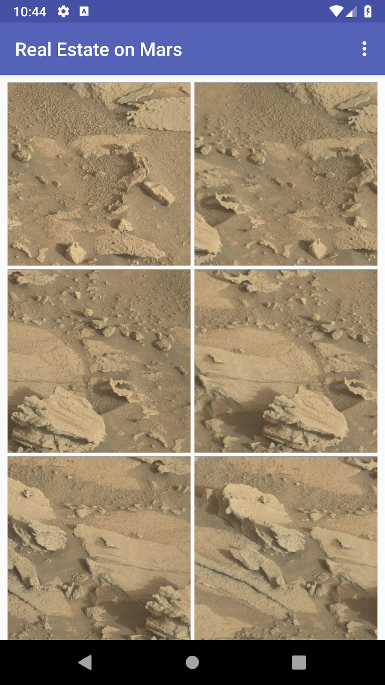
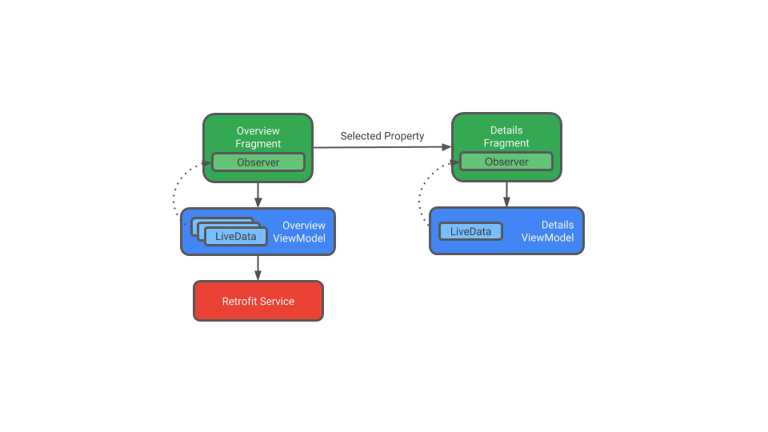
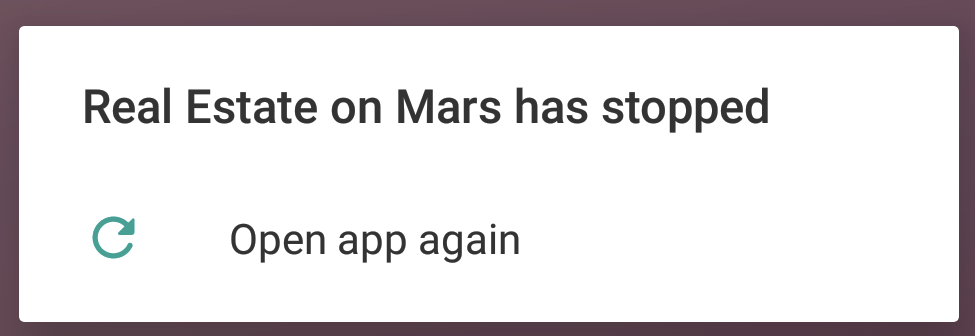
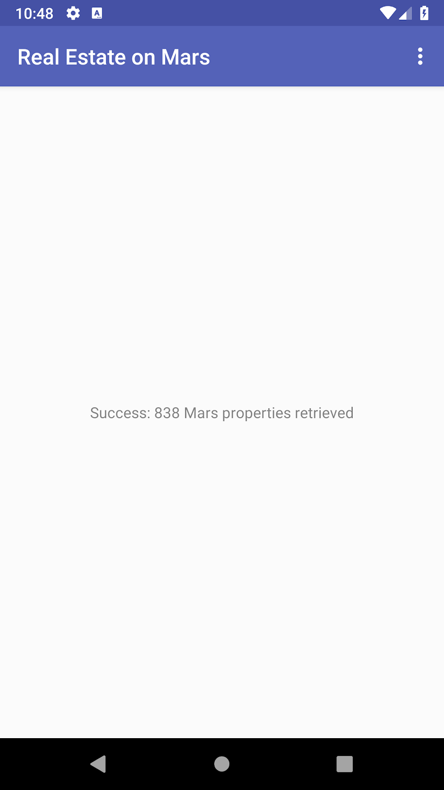

### App overview

In this project (and the following projects), you work with a starter app called MarsRealEstate, which shows properties for sale on Mars. This app connects to a web service to retrieve and display the property data, including details such as the price and whether the property is available for sale or rent. The images representing each property are real-life photos from Mars captured from NASA's Mars rovers.



The version of the app you build in this project won't have a lot of visual flash: it focuses on the networking layer part of the app to connect to the internet and download the raw property data using a web service. To ensure that the data is correctly retrieved and parsed, you'll just print the number of properties on Mars in a text view:

### Task: Explore the MarsRealEstate starter app

The architecture for the MarsRealEstate app has two main modules:

- An overview fragment, which contains a grid of thumbnail property images, built with a RecyclerView.
- A detail view fragment, containing information about each property.



The app has a ViewModel for each fragment. For this codelab, you create a layer for the network service, and the ViewModel communicates directly with that network layer. This is similar to what you did in previous codelabs when the ViewModel communicated with the Room database.

The overview ViewModel is responsible for making the network call to get the Mars real estate information. The detail ViewModel holds details for the single piece of Mars real estate that's displayed in the detail fragment. For each ViewModel, you use LiveData with lifecycle-aware data binding to update the app UI when the data changes.

You use the Navigation component to both navigate between the two fragments, and to pass the selected property as an argument.

In this task, you download and run the starter app for MarsRealEstate and familiarize yourself with the structure of the project.

#### Step 1: Explore fragments and navigation

- Download the [MarsRealEstate](https://drive.google.com/drive/folders/1COOEOSV5jafxQt8KdCVPWm5EvKIupHuA?usp=sharing) starter app and open it in Android Studio.
- Examine app/java/MainActivity.kt. The app uses fragments for both screens, so the only task for the activity is to load the activity's layout.
- Examine app/res/layout/activity_main.xml. The activity layout is the host for the two fragments, defined in the navigation file. This layout instantiates a NavHostFragment and its associated navigation controller with the nav_graph resource.
- Open app/res/navigation/nav_graph.xml. Here you can see the navigation relationship between the two fragments. The navigation graph StartDestination points to the overviewFragment, so the overview fragment is instantiated when the app is launched.

### Step 2: Explore Kotlin source files and data binding

- In the Project pane, expand app > java. Notice that the MarsRealEstate app has three package folders: detail, network, and overview. These correspond to the three major components of your app: the overview and detail fragments, and the code for the network layer.


- Open app/java/overview/OverviewFragment.kt. The OverviewFragment lazily initializes the OverviewViewModel, which means the OverviewViewModel is created the first time it is used.

- Examine the onCreateView() method. This method inflates the fragment_overview layout using data binding, sets the binding lifecycle owner to itself (this), and sets the viewModel variable in the binding object to it. Because we've set the lifecycle owner, any LiveData used in data binding will automatically be observed for any changes, and the UI will be updated accordingly.

- Open app/java/overview/OverviewViewModel. Because the response is a LiveData and we've set the lifecycle for the binding variable, any changes to it will update the app UI.

- Examine the init block. When the ViewModel is created, it calls the getMarsRealEstateProperties() method.

- Examine the getMarsRealEstateProperties() method. In this starter app, this method contains a placeholder response. The goal for this codelab is to update the response LiveData within the ViewModel using real data you get from the internet.

- Open app/res/layout/fragment_overview.xml. This is the layout for the overview fragment you work with in this codelab, and it includes the data binding for the view model. It imports the OverviewViewModel and then binds the response from the ViewModel to a TextView. In later codelabs, you replace the text view with a grid of images in a RecyclerView.

- Compile and run the app. All you see in the current version of this app is the starter response—"Set the Mars API Response here!"


### Task: Connect to a web service with Retrofit

The Mars real estate data is stored on a web server, as a REST web service. Web services use the REST architecture are built using standard web components and protocols.

You make a request to a web service in a standardized way via URIs. The familiar web URL is actually a type of URI, and both are used interchangeably throughout this course. For example, in the app for this lesson, you retrieve all the data from the following server:

https://android-kotlin-fun-mars-server.appspot.com

If you type the following URL in your browser, you get a list of all available real estate properties on Mars!

https://android-kotlin-fun-mars-server.appspot.com/realestate

The response from a web service is commonly formatted in JSON, an interchange format for representing structured data. You learn more about JSON in the next task, but the short explanation is that a JSON object is a collection of key-value pairs, sometimes called a dictionary, a hash map, or an associative array. A collection of JSON objects is a JSON array, and it's the array you get back as a response from a web service.

To get this data into the app, your app needs to establish a network connection and communicate with that server, and then receive and parse the response data into a format the app can use. In this codelab, you use a REST client library called Retrofit to make this connection.

#### Step 1: Add Retrofit dependencies to Gradle

- Open build.gradle (Module: app).

- In the dependencies section, add these lines for the Retrofit libraries:

- implementation "com.squareup.retrofit2:retrofit:$version_retrofit"

- implementation "com.squareup.retrofit2:converter-scalars:$version_retrofit"

***Notice that the version numbers are defined separately in the project Gradle file. The first dependency is for the Retrofit 2 library itself, and the second dependency is for the Retrofit scalar converter. This converter enables Retrofit to return the JSON result as a String. The two libraries work together.***

- Click Sync Now to rebuild the project with the new dependencies.

#### Step 2: Add support for Java 8 language features

Many third party libraries including Retrofit2 use Java 8 language features. The Android Gradle plugin provides built-in support for using certain Java 8 language features. To use these built-in features, update the module's build.gradle file, as shown below:

```
android {
  ...

  compileOptions {
    sourceCompatibility JavaVersion.VERSION_1_8
    targetCompatibility JavaVersion.VERSION_1_8
  }
  
  kotlinOptions {
    jvmTarget = JavaVersion.VERSION_1_8.toString()
  }
}
```

#### Step 3: Implement MarsApiService

Retrofit creates a network API for the app based on the content from the web service. It fetches data from the web service and routes it through a separate converter library that knows how to decode the data and return it in the form of useful objects. Retrofit includes built-in support for popular web data formats such as XML and JSON. Retrofit ultimately creates most of the network layer for you, including critical details such as running the requests on background threads.

The MarsApiService class holds the network layer for the app; that is, this is the API that your ViewModel will use to communicate with the web service. This is the class where you will implement the Retrofit service API.

- Open app/java/network/MarsApiService.kt. Right now the file contains only one thing: a constant for the base URL for the web service.

```
private const val BASE_URL = 
   "https://android-kotlin-fun-mars-server.appspot.com"
```

- Just below that constant, use a Retrofit builder to create a Retrofit object. Import retrofit2.Retrofit and retrofit2.converter.scalars.ScalarsConverterFactory when requested.

```
private val retrofit = Retrofit.Builder()
   .addConverterFactory(ScalarsConverterFactory.create())
   .baseUrl(BASE_URL)
   .build()
```

Retrofit needs at least two things available to it to build a web services API: the base URI for the web service, and a converter factory. The converter tells Retrofit what do with the data it gets back from the web service. In this case, you want Retrofit to fetch a JSON response from the web service, and return it as a String. Retrofit has a ScalarsConverter that supports strings and other primitive types, so you call addConverterFactory() on the builder with an instance of ScalarsConverterFactory. Finally, you call build() to create the Retrofit object.

- Just below the call to the Retrofit builder, define an interface that defines how Retrofit talks to the web server using HTTP requests. Import retrofit2.http.GET and retrofit2.Call when requested.

```
interface MarsApiService {
    @GET("realestate")
    fun getProperties():
            Call<String>
}
```

Right now the goal is to get the JSON response string from the web service, and you only need one method to do that: getProperties(). To tell Retrofit what this method should do, use a @GET annotation and specify the path, or endpoint, for that web service method. In this case the endpoint is called realestate. When the getProperties() method is invoked, Retrofit appends the endpoint realestate to the base URL (which you defined in the Retrofit builder), and creates a Call object. That Call object is used to start the request.

- Below the MarsApiService interface, define a public object called MarsApi to initialize the Retrofit service.

```
object MarsApi {
    val retrofitService : MarsApiService by lazy { 
       retrofit.create(MarsApiService::class.java) }
}
```

- The Retrofit create() method creates the Retrofit service itself with the MarsApiService interface. Because this call is expensive, and the app only needs one Retrofit service instance, you expose the service to the rest of the app using a public object called MarsApi, and lazily initialize the Retrofit service there. Now that all the setup is done, each time your app calls MarsApi.retrofitService, it will get a singleton Retrofit object that implements MarsApiService.

#### Step 4: Call the web service in OverviewViewModel

- Open app/java/overview/OverviewViewModel.kt. Scroll down to the getMarsRealEstateProperties() method.

```
private fun getMarsRealEstateProperties() {
   _response.value = "Set the Mars API Response here!"
}
```

This is the method where you'll call the Retrofit service and handle the returned JSON string. Right now there's just a placeholder string for the response.

- Delete the placeholder line that sets the response to "Set the Mars API Response here!"

- Inside getMarsRealEstateProperties(), add the code shown below. Import retrofit2.Callback and com.example.android.marsrealestate.network.MarsApi when requested.

- The MarsApi.retrofitService.getProperties() method returns a Call object. Then you can call enqueue() on that object to start the network request on a background thread.

```
MarsApi.retrofitService.getProperties().enqueue( 
   object: Callback<String> {
})
```

- Click on the word object, which is underlined in red. Select Code > Implement methods. Select both onResponse() and onFailure() from the list.


Android Studio adds the code with TODOs in each method:

```
override fun onFailure(call: Call<String>, t: Throwable) {
       TODO("not implemented") 
}


override fun onResponse(call: Call<String>, 
   response: Response<String>) {
       TODO("not implemented") 
}
```

In onFailure(), delete the TODO and set the _response to a failure message, as shown below. The _response is a LiveData string that determines what's shown in the text view. Each state needs to update the _response LiveData.

- The onFailure() callback is called when the web service response fails. For this response, set the _response status to "Failure: " concatenated with the message from the Throwable argument.

```
override fun onFailure(call: Call<String>, t: Throwable) {
   _response.value = "Failure: " + t.message
}
```

- In onResponse(), delete the TODO and set the _response to the response body. The onResponse() callback is called when the request is successful and the web service returns a response.

```
override fun onResponse(call: Call<String>, 
   response: Response<String>) {
      _response.value = response.body()
}
```

#### Step 4: Define the internet permission

- Compile and run the MarsRealEstate app. Note that the app closes immediately with an error. 



- Click the Logcat tab in Android Studio and note the error in the log, which starts with a line like this:

- Process: com.example.android.marsrealestate, PID: 10646

```
java.lang.SecurityException: Permission denied (missing INTERNET permission?)
```

The error message tells you that your app might be missing the INTERNET permission. Connecting to the internet introduces security concerns, which is why apps do not have internet connectivity by default. You need to explicitly tell Android that the app needs access to the internet.

- Open app/manifests/AndroidManifest.xml. Add this line just before the <application> tag:

```
<uses-permission android:name="android.permission.INTERNET" />
```

- Compile and run the app again. If everything is working correctly with your internet connection, you see JSON text containing Mars Property data.

- Tap the Back button in your device or emulator to close the app.

- Put your device or emulator into airplane mode, and then reopen the app from the Recents menu, or restart the app from Android Studio.


- Turn airplane mode off again.

#### Task: Parse the JSON response with Moshi

Now you're getting a JSON response from the Mars web service, which is a great start. But what you really need are Kotlin objects, not a big JSON string. There's a library called Moshi, which is an Android JSON parser that converts a JSON string into Kotlin objects. Retrofit has a converter that works with Moshi, so it's a great library for your purposes here.

In this task, you use the Moshi library with Retrofit to parse the JSON response from the web service into useful Mars Property Kotlin objects. You change the app so that instead of displaying the raw JSON, the app displays the number of Mars Properties returned.

#### Step 1: Add Moshi library dependencies

- pen build.gradle (Module: app).

- In the dependencies section, add the code shown below to include the Moshi dependency. As with Retrofit, $version_moshi is defined separately in the project-level Gradle file. This dependency adds support for the Moshi JSON library with Kotlin support.

- implementation "com.squareup.moshi:moshi-kotlin:$version_moshi"

- Locate the lines for the Retrofit scalar converter in the dependencies block:

- implementation "com.squareup.retrofit2:retrofit:$version_retrofit"

- implementation "com.squareup.retrofit2:converter-scalars:$version_retrofit"

- Change these lines to use converter-moshi:

- implementation "com.squareup.retrofit2:converter-moshi:$version_retrofit"

- Click Sync Now to rebuild the project with the new dependencies.

***Note: The project may show compiler errors related to the removed Retrofit scalar dependency. You fix those in the next steps.***

#### Step 2: Implement the MarsProperty data class

A sample entry of the JSON response you get from the web service looks something like this:

```
[{"price":450000,
"id":"424906",
"type":"rent",
"img_src":"http://mars.jpl.nasa.gov/msl-raw-images/msss/01000/mcam/1000ML0044631300305227E03_DXXX.jpg"},
...]
```

The JSON response shown above is an array, which is indicated by the square brackets. The array contains JSON objects, which are surrounded by curly braces. Each object contains a set of name-value pairs, separated by colons. Names are surrounded by quotes. Values can be numbers or strings, and strings are also surrounded by quotes. For example, the price for this property is $450,000 and the img_src is a URL, which is the location of the image file on the server.

In the example above, notice that each Mars property entry has these JSON key and value pairs:

```
price: the price of the Mars property, as a number.
id: the ID of the property, as a string.
type: either "rent" or "buy".
img_src: The image's URL as a string.
```

Moshi parses this JSON data and converts it into Kotlin objects. To do this, it needs to have a Kotlin data class to store the parsed results, so the next step is to create that class.

- Open app/java/network/MarsProperty.kt.

- Replace the existing MarsProperty class definition with the following code:

```
data class MarsProperty(
   val id: String, val img_src: String,
   val type: String,
   val price: Double
)
```

Notice that each of the variables in the MarsProperty class corresponds to a key name in the JSON object. To match the types in the JSON, you use String objects for all the values except price, which is a Double. A Double can be used to represent any JSON number.

When Moshi parses the JSON, it matches the keys by name and fills the data objects with appropriate values.

- Replace the line for the img_src key with the line shown below. Import com.squareup.moshi.Json when requested.

```
@Json(name = "img_src") val imgSrcUrl: String,
```

Sometimes the key names in a JSON response can make confusing Kotlin properties, or may not match your coding style—for example, in the JSON file the img_src key uses an underscore, whereas Kotlin properties commonly use upper and lowercase letters ("camel case").

To use variable names in your data class that differ from the key names in the JSON response, use the @Json annotation. In this example, the name of the variable in the data class is imgSrcUrl. The variable is mapped to the JSON attribute img_src using @Json(name = "img_src").

#### Step 3: Update MarsApiService and OverviewViewModel

With the MarsProperty data class in place, you can now update the network API and ViewModel to include the Moshi data.

- Open network/MarsApiService.kt. You may see missing-class errors for ScalarsConverterFactory. This is because of the Retrofit dependency change you made in Step 1. You fix those errors soon.

- At the top of the file, just before the Retrofit builder, add the following code to create the Moshi instance. Import com.squareup.moshi.Moshi and com.squareup.moshi.kotlin.reflect.KotlinJsonAdapterFactory when requested.

```
private val moshi = Moshi.Builder()
   .add(KotlinJsonAdapterFactory())
   .build()
```

Similar to what you did with Retrofit, here you create a moshi object using the Moshi builder. For Moshi's annotations to work properly with Kotlin, add the KotlinJsonAdapterFactory, and then call build().

- Change the Retrofit builder to use the MoshiConverterFactory instead of the ScalarConverterFactory, and pass in the moshi instance you just created. Import retrofit2.converter.moshi.MoshiConverterFactory when requested.

```
private val retrofit = Retrofit.Builder()
   .addConverterFactory(MoshiConverterFactory.create(moshi))
   .baseUrl(BASE_URL)
   .build()
```

- Delete the import for ScalarConverterFactory as well.

Code to delete:

```
import retrofit2.converter.scalars.ScalarsConverterFactory
Update the MarsApiService interface to have Retrofit return a list of MarsProperty objects, instead of returning Call<String>.
interface MarsApiService {
   @GET("realestate")
   fun getProperties():
      Call<List<MarsProperty>>
}
```

- Open OverviewViewModel.kt. Scroll down to the call to getProperties().enqueue() in the getMarsRealEstateProperties() method.

- Change the argument to enqueue() from Callback<String> to Callback<List<MarsProperty>>. Import com.example.android.marsrealestate.network.MarsProperty when requested.

```
MarsApi.retrofitService.getProperties().enqueue( 
   object: Callback<List<MarsProperty>> {
```

- In onFailure(), change the argument from Call<String> to Call<List<MarsProperty>>:

```
override fun onFailure(call: Call<List<MarsProperty>>, t: Throwable) {
```

- Make the same change to both the arguments to onResponse():

```
override fun onResponse(call: Call<List<MarsProperty>>, 
   response: Response<List<MarsProperty>>) {
```

- In the body of onResponse(), replace the existing assignment to _response.value with the assignment shown below. Because the response.body() is now a list of MarsProperty objects, the size of that list is the number of properties that were parsed. This response message prints that number of properties:

```
_response.value = 
   "Success: ${response.body()?.size} Mars properties retrieved"
```

- Make sure airplane mode is turned off. Compile and run the app. This time the message should show the number of properties returned from the web service:



***Note: If your internet connection is not working, make sure that you turned off airplane mode on your device or emulator.***

### Task: Use coroutines with Retrofit

Now the Retrofit API service is running, but it uses a callback with two callback methods that you had to implement. One method handles success and another handles failure, and the failure result reports exceptions. Your code would be more efficient and easier to read if you could use coroutines with exception handling, instead of using callbacks. In this task, you convert your network service and the ViewModel to use coroutines.

#### Step 1: Update MarsApiService and OverviewViewModel

- In MarsApiService, make getProperties() a suspend function. Change Call<List<MarsProperty>> to List<MarsProperty>. The getProperties() method looks like this:

```
@GET("realestate")
suspend fun getProperties(): List<MarsProperty>
```

- In the OverviewViewModel.kt file, delete all the code inside getMarsRealEstateProperties(). You'll use coroutines here instead of the call to enqueue() and the onFailure() and onResponse() callbacks.

- Inside getMarsRealEstateProperties(), launch the coroutine using viewModelScope.

```
viewModelScope.launch { 

}
```

- A ViewModelScope is the built-in coroutine scope defined for each ViewModel in your app. Any coroutine launched in this scope is automatically canceled if the ViewModel is cleared.

- Inside the launch block, add a try/catch block to handle exceptions:

```
try {

} catch (e: Exception) {
  
}
```

- Inside the try {} block, call getProperties() on the retrofitService object:

```
val listResult = MarsApi.retrofitService.getProperties()
```

Calling getProperties() from the MarsApi service creates and starts the network call on a background thread.

- Also inside the try {} block, update the response message for the successful response:

```
_response.value = 
   "Success: ${listResult.size} Mars properties retrieved"
Inside the catch {} block, handle the failure response:
_response.value = "Failure: ${e.message}"
```

- The complete getMarsRealEstateProperties() method now looks like this:

```
private fun getMarsRealEstateProperties() {
   viewModelScope.launch {
       try {
           val listResult = MarsApi.retrofitService.getProperties()
           _response.value = "Success: ${listResult.size} Mars properties retrieved"
       } catch (e: Exception) {
           _response.value = "Failure: ${e.message}"
       }
   }
}
```

- Compile and run the app. You get the same result this time as in the previous task (a report of the number of properties), but with more straightforward code and error handling.
