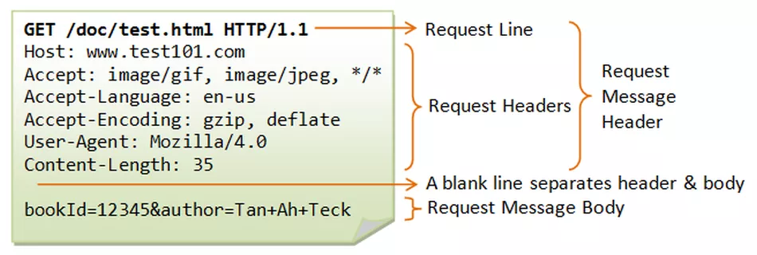
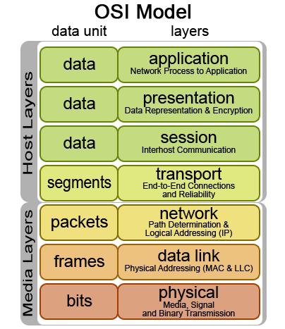

## 1. Ideate

Now that we have examined the industry we are operating in and analysed our potential users, we can enter the third phase the Human-Centered Design process: Ideate. In this phase we are brainstorming and creating ideas for a game and website using the specific information we have gathered during the ‘Empathise’ and ‘Define’ stages. It is important to keep within the framework that you have researched in the previous two phases because you want to create a product that reflects the needs and goals you have observed.

We will start the ideate process by learning more about the web and then look at generating ideas for a successful online business. During these units you will be expected to come up with ideas for your game and the website it will operate within.

## 2. The Internet and WWW

### What is The Internet?

The Internet is a massive network of networks, a networking infrastructure. It connects billions of computers and internet-enabled devices together globally, forming a network in which any device can communicate with any other device as long as they are both connected to the Internet. Information that travels over the Internet does so via a variety of languages known as protocols.

[Brief history of the Internet](https://youtu.be/h8K49dD52WA)

### The Internet and The Web (World Wide Web)?

The World Wide Web, or simply Web, is a way of accessing information over the medium of the Internet and it is the most major application of internet technology today. It is an information-sharing model that is built on top of the Internet.

These days, we often just say “The Internet” when we refer to anything we access via a web browser or smartphone. However, the World Wide Web and the Internet aren’t the same thing. The Web uses a specific protocol called HTTP (hypertext transfer protocol), which is just one of the protocols used to transmit information over the Internet. For example, the Internet, not the Web, is also used for e-mail (which uses IMAP, POP and SMTP), instant messaging, peer-to-peer networks, and FTP (file transfer protocol). So the Web is just a portion of the Internet, albeit a large portion, but the two terms are not synonymous and should not be confused.  

[How does the Internet work?](https://youtu.be/7_LPdttKXPc)

Read the document linked below to learn more about how the Internet works, including SMTP, TCP, FTP, and DNS protocols:

https://web.stanford.edu/class/msande91si/www-spr04/readings/week1/InternetWhitepaper.htm

## 3. HTTP and Web applications

### What does the web look like?

 - The Web is a distributed information system

 - It is made up of web pages (files/documents)

 - These pages contain multimedia (text, images, video, etc)

 - They are linked together via hyperlinks

 - A website is a collection of web pages

 - Websites are stored on computers called web servers

 - A web browser is a piece of software that uses HTTP (hypertext transfer protocol) to retrieve and view web pages

 - It’s able to do this by using a website’s uniform resource locator (URL) - which can be found in the address bar of a current page

 - Secure web pages use encryption like HTTPS to protect themselves from eavesdroppers

### What is HTTP?

#### HTTP (Hypertext Transfer Protocol)

Hypertext Transfer Protocol provides a [network protocol](https://www.lifewire.com/computer-networks-protocols-817374) standard that web browsers and servers use to communicate. You see HTTP everyday, because when you visit a website the protocol's written right in the [URL](https://www.lifewire.com/what-is-a-url-2626035) (e.g. http://www.lifewire.com).

HTTP is an application layer protocol built on top of TCP that uses a client-server communication model. HTTP clients and servers communicate through request-and-response messages. The three main HTTP message types are GET, POST, and HEAD.

 - *HTTP GET* messages sent to a server contain only a URL. Zero or more optional data parameters may be appended to the end of the URL. The server processes the optional data portion of the URL, if present, and returns the result (a web page or element of a web page) to the browser.

 - *HTTP POST* messages place any optional data parameters in the body of the request message rather than adding them to the end of the URL.

 - *HTTP HEAD* requests work the same as GET requests. Instead of replying with the full contents of the URL, the server sends back only the header information (contained inside the HTML section).
http request

The browser initiates communication with an HTTP server by initiating a TCP connection to the server. Web browsing sessions use server port 80 by default, although other ports such as 8080 are sometimes used instead.

After a session is established, you trigger the sending and receiving of HTTP messages by visiting the web page.

HTTP is what's called a stateless system. What this means is that unlike other file transfer protocols such as FTP, the HTTP connection is dropped after the request has been completed. So, after your web browser sends the request and the server responds with the page, the connection is closed.

#### HTTPS (Hypertext Transfer Protocol Secure)

Hypertext Transfer Protocol Secure is a secure version of HTTP. This protocol enables secure communication between a client (e.g. web browser) and a server (e.g. web server) by using encryption. HTTPS uses *Transport Layer Security (TLS)* protocol or its predecessor *Secure Sockets Layer (SSL)* for encryption.

HTTPS is commonly used to create a secure channel over some insecure network, e.g. Internet. A lot of traffic on the Internet is unencrypted and susceptible to sniffing attacks. HTTPS encrypts sensitive information, which makes a connection secure. Many browsers use https by default now. You can verify that the information is encrypted by looking for a small "lock" symbol in the address bar of most browsers.

### Intranet vs. Extranet

An *intranet* is a private computer network based on the communication standards of the Internet. It is a smaller, private version of the internet that only members of an organization can access. Companies can create this kind of secure and manageable version of the Web to disseminate and share only the information relevant to their business. This can increase productivity as corporate knowledge becomes more accessible and the data is specific, monitored and accurate.

An *extranet* is a computer network that allows controlled access from the outside, for specific business or educational purposes. In a business-to-business context, an extranet can be viewed as an extension of an organization's intranet that is extended to users outside the organization; usually partners, vendors, and suppliers, in isolation from all other Internet users. An extranet is similar to a demilitarized zone (DMZ) in that it provides access to needed services for channel partners, without granting access to an organization's entire network.

#### What can you do with an intranet or an extranet?

Here are a few examples:

*Document distribution*
Reducing cost and improving timeliness of distributed information
Exchange large volumes of data using Electronic Data Interchange (EDI)
Provide a secure medium for the distribution of confidential information

*Inter-company communication*
Share product catalogs exclusively with trade partners
Database access

*Provide interactive services*
Conduct company wide surveys
Develop and use training programs
Manage customer support portal

*Collaborate with other companies*
Provide or access services provided by one company to a group of other companies, eg. training, online banking application managed by one company on behalf of affiliated banks

Intranet and extranets have a wide variety of advantages but like with anything they have their downsides too. For example extranets can be expensive to implement and maintain, especially if hosted internally rather than by an application service provider (e.g. hardware, software, employee training costs), and their security can be a concern when hosting valuable or proprietary information. Keep this in mind when considering using them.

### Web applications

The internet has expanded since its inception and nowadays we use it in a wide variety of ways. Apart from the obvious communication methods it has provided like email, instant messaging and voice/video calling, there are now a huge selection of interactive interfaces that operate entirely on the internet and make use of cloud technologies and handheld devices to provide services previously untouched by technology. These web applications range from online shopping to business accounting, health monitoring, and everything in between. Online gaming is therefore one of many competing services being provided through internet technology.

#### Web Communication

*Webmail*

The term Webmail (or Web-based email) is an email service offered by a company or Internet service provider through a website. Common examples are Gmail or Yahoo! Mail.

With the advent of handheld devices, webmail, is more often than not, now accessed through an email client rather than a web browser. For example iOS and Android devices both have native Mail applications that use the IMAP, POP and SMTP protocols to receive and send mail. You can also find other applications that will do the same. This is not a new technology and has existed almost since the advent of the Internet but it has become more commonly used with mobile phones. It’s main advantage is that you can manage multiple webmails through one application and you can access your mail even when you’re offline.

*Instant messaging (IM)*
This is a form of communication over the web that offers quick transmission of text-based messages from sender to receiver. More advanced instant messaging allows enhanced modes of communication, such as live voice or video calling, video chat and inclusion of hyperlinks to media. Whatsapp, iMessage and Facebook Messenger are examples of instant messaging.

*VoIP*
VoIP (Voice over Internet Protocol) is a set of technologies that enable voice calls to be carried over the Internet. Skype and Whatsapp Audio calls are examples of this.

The basic process involved in a VoIP call is as follows:

1. Conversion of the caller’s analogue voice signal into a digital format
2. Compression and translation of the digital signal into discrete Internet Protocol packets
3. Transmission of the packets over the Internet or other IP-based network
4. Reverse translation of packets into an analogue voice signal for the call recipient

What you need to make a VoIP call

To make a VoIP call, the consumer user requires VoIP software and a connection to the Internet. The software will handle the call routing to make sure the call reaches the intended destination. The software can be installed on a variety of hardware devices including traditional telephone handsets (using an adaptor that plugs into the telephone), or on your computer or smartphone.

### OSI Model

All of the web applications above operate on the Application Layer of Open Systems Interconnection (OSI) model. The OSI model is a framework used to understand how data is sent across the Internet, even down to the individual 1s and 0s. The basic model looks like this:

You can learn more about these layers at this website:

https://osi-model.com/

Or by watching this video:

https://youtu.be/AEaKrq3SpW8