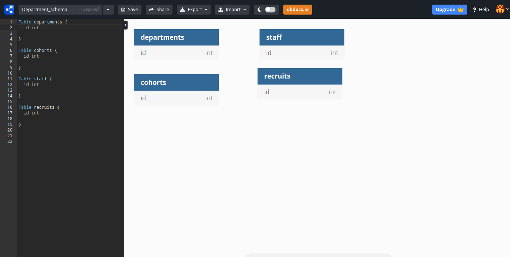
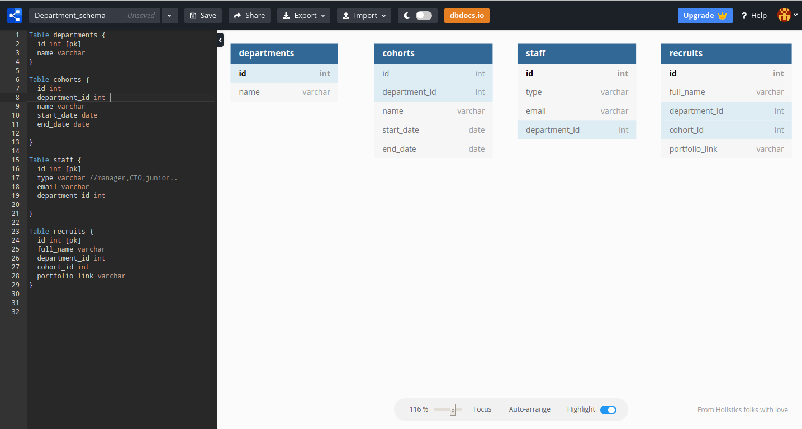
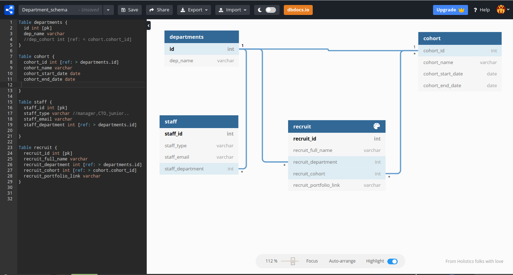
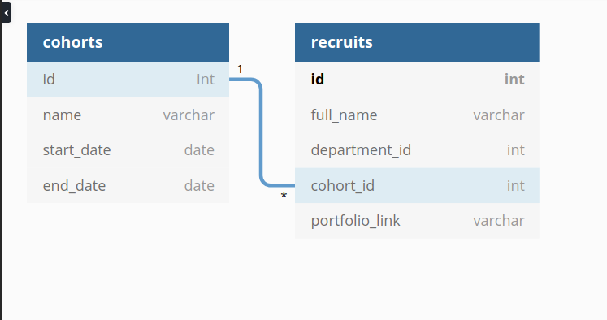
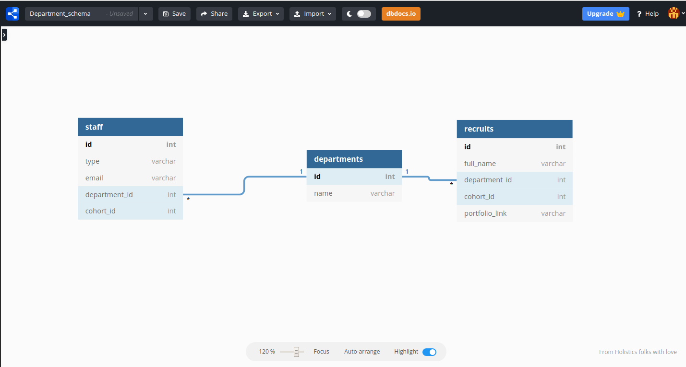

In this topic, we will discuss the schema design. Here is what Wikipedia says about "Database Schema":

> The database schema of a database is its structure described in a formal language supported by the database management system. The term "schema" refers to the organization of data as a blueprint of how the database is constructed. [Wikipedia](https://en.wikipedia.org/wiki/Database_schema)

To help us understand the design process we will design an Umuzi.org physical database as an example. We will use Entity Relationship Diagram  (ERD) as a method to design our schema, I have selected [dbdiagram](https://dbdiagram.io) as a  tool to help us achieve this objective, I find the tool painless and straightforward, it provides fast feedback and I get to download a physical database right after, feel free to explore alternatives on the internet or experiment along.

This topic requires that you are a little bit familiar with [SQL](https://www.youtube.com/watch?v=27axs9dO7AE).

## The brief


As a developer working on a product you have been given a ticket that has the following requirements:
>Design a Umuzi's department database schema to handle data related to it.

The strategist on the team has added the following details to your ticket:
> The database you are about to design should handle the following queries
-  if the user has a recruit's full name he/she should be able to find which cohort the recruit belongs to.
-  if the user has a cohort name he/she should be able to find recruit(s) in it.
-  if the user has a staff member's email he/she should be able to retrieve recruits  he/she is servicing


## The steps

  Step 1:   idetify `entities` within a deparment
  ---

 Our "Umuzi" schema to include the following entities:

 - Departments
 - Cohorts
 - Recruits
 - staff




  Step 2: Add the other attributes
  ---
let establish all entities with their names and properties




  Step 3: establish  relationships
  ---

  Each entity, attribute and relationship, should have appropriate names and that can be easily understood by the non-technical people as well. A relationship should connect entities.

 our entities within the "department schema" have the following relationships:

- Each department has a one or more staff member, a staff member is part of only one department at a time
- each cohort is linked to one or more department(s)
- each cohort has one or more recruits

We will consider only this scenario for now.



Step 4: Create queries

So far we have identified entities, added attributed to our entities, and established relationships. It about time we create queries as required on our ticket.

Do you recall the 4 queries? Great!

1. if the user has a recruit's full name he/she should be able to find which cohort the recruit belongs to.

Let have a closer look at the relationship between recruits and cohorts, one recruits should belong to one cohort at a time, `one to one relationship`.



From this relationship a SQL query could look as follow :

```
SELECT cohorts.name FROM cohorts
 JOIN recruits ON cohorts.cohort.id=recruits.cohort_id
WHERE recruits.name ='Lufuno Bourgier'
```

-  if the user has a cohort name he/she should be able to find recruit(s) in it.

This is a reverse operation from the previous one, `one to many`.

```
SELECT recruits.name
 FROM recruits
 JOIN cohorts ON recruits.cohort_id = cohorts.id
WHERE cohort.id = 'Cx'
 ```

-  if the user has a staff member's email he/she should be able to retrieve recruits  he/she is servicing

There seems to be no direct link between a recruits entity and staff entity, however, they both share one property which is a `department id`, once the relationship between staff entity and the recruits entity is established, we will what is called a `many to many` relationships as illustrated bellow.



A SQL query could look as follow:

```
SELECT recruits.name
 FROM recruits
 JOIN departments on recruits.department_id = department.id
 JOIN staff on department.id = staff.department_id
WHERE staff.email = 'name.surname@umuzi.org'
```


Voila!

## A note about redundant records

Redundant tables and fields are a nightmare for database designers and administrators.

They draw on system resources in order to keep them secure, current and backed up. Redundant records may not seem like much when you are talking about just a dozen or so.

But in large databases where redundant fields could number thousands or millions, the computing resource overheads are substantial.

They unnecessarily increase the size of the database thus reducing efficiency and increasing the risk of data corruption.

Of course, there are times where redundancy may be necessary but this should be the exception and not the rule.

Even when redundancy is allowed, the reasons should be clearly documented to ensure removal by future database administrators when the reasons are no longer valid.

## Conclusion

Designing a database schema design is fairly a simple process, yet can prove to be complicated if the steps involved and concepts are not well implemented. This topic has defined a  database schema design, depicted entity discovery process, and finally explained the process of establishing relationships between entities.


## For more:

- To find out more about the difference bettwen **data model** and **database schema** please click [here](https://www.quora.com/What-is-the-difference-between-a-data-model-and-database-schema)
- To find more about *database design* please click [here](https://www.guru99.com/database-design.html)
- [Learn SQL](https://www.w3schools.com/sql/sql_intro.asp).
- Find out more about relational database [here](https://dev.to/lmolivera/everything-you-need-to-know-about-relational-databases-3ejl)
- Check out [this article](https://likegeeks.com/database-design-mistakes/) on few mistakes in database design