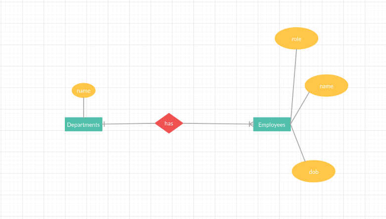
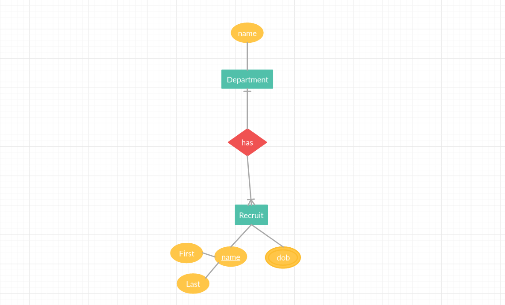

In this topic, we will discuss the schema design. Here is what Wikipedia says about "Database Schema":

> The database schema of a database is its structure described in a formal language supported by the database management system. The term "schema" refers to the organization of data as a blueprint of how the database is constructed. [Wikipedia](https://en.wikipedia.org/wiki/Database_schema)

To help us understand the design process we will design an Umuzi.org physical database as an example. We will use Entity Relationship Diagram  (ERD) as a method to design our schema, I have selected [dbdiagram](https://dbdiagram.io) as a  tool to help us achieve this objective, I find the tool painless and straightforward, it provides fast feedback and I get to download a physical database right after, feel free to explore alternatives on the internet or experiment along.

This topic requires that you are a little bit familiar with [SQL](https://www.youtube.com/watch?v=27axs9dO7AE).

## The brief

As an educational instruction, Umuzi.org plan to develop a database that will
help different users retrieve specific information when needed efficiently. You have been selected by the tech team leadership to design and develop the database.

We will first focus on designing the database using entity-relationship diagram (ERD). We will then proceed with converting our ERD into tables.

## Entity-relationship diagram (ERD)

As the name implies, the entity-relationship diagram is all about relationship. For us to establish relationships we need to uncover different parts that make Umuzi.org. Let note that the discovered elements
are those from which data is needed, they are also called `entities`.

1. Cohorts
2. Recruits
3. Employees
4. Departments

So far these are entities from which the management will require information
---
title: SQL Database schema design
ready: True
---

In this topic, we will discuss the schema design. Here is what Wikipedia says about "Database Schema":

> The database schema of a database is its structure described in a formal language supported by the database management system. The term "schema" refers to the organization of data as a blueprint of how the database is constructed. [Wikipedia](https://en.wikipedia.org/wiki/Database_schema)

To help us understand the design process we will design an Umuzi.org physical database as an example. We will use Entity Relationship Diagram  (ERD) as a method to design our schema, I have selected [dbdiagram](https://dbdiagram.io) as a  tool to help us achieve this objective, I find the tool painless and straightforward, it provides fast feedback and I get to download a physical database right after, feel free to explore alternatives on the internet or experiment along.

This topic requires that you are a little bit familiar with [SQL](https://www.youtube.com/watch?v=27axs9dO7AE).

## The brief

As an educational instruction, Umuzi.org plan to develop a database that will
help different users retrieve specific information when needed efficiently. You have been selected by the tech team leadership to design and develop the database.

We will first focus on designing the database using entity-relationship diagram (ERD). We will then proceed with converting our ERD into tables.

## Entity-relationship diagram (ERD)

As the name implies, the entity-relationship diagram is all about relationship. For us to establish relationships we need to uncover different parts that make Umuzi.org. Let note that the discovered elements
are those from which data is needed, they are also called `entities`.

1. Cohorts
2. Recruits
3. Employees
4. Departments

So far these are entities from which the management will require information

### The relationships

It is important to uncover the relationship between entities, this will make sense later in this topic. Let examine a few of them for now.

#### Cohorts and recruits

A cohort contains one or more recruits, on the other hand, a recruit can only belong to one cohort at a time.

#### Department and cohorts

A department contains one or more cohorts.

#### Departments and employees

Each department has one or more employees, employees are part of one department at a time only.

 

#### Recruits and departments

Each department has one or more recruits, and recruits belong to a department at a time.

#### Final view

#### Tabular view

##### Departments

A department is managed by one employee (Head of a department) at a time. This is also called a `one to one relationship`. The `employee_id` is a `foreign key` with a `unique constraint`.

| id | name | `employee_id` |
|----|------|---------------|

##### Cohorts

| id | name | start_date | end_date |
|----|------|------------|----------|

##### Cohort leadership

A cohort at Umuzi.org can be managed by one or more employee from the same department.
This said to be a `one to many relationships`, the `employee_id` is said to be a `foreign key` with `no unique constraint`.
from the cohort and Employees tables, we derive the following table.

| id | `employee_id` | `cohort_id` |
|----|-------------|-----------|

##### Employees

| id | f_name | l_name | dob | `department_id` | `role_id` |
|----|--------|--------|-----|---------------|---------|

##### Recruits

| id | f_name | l_name | dob | `department_id` | `cohort_id` |
|----|--------|--------|-----|---------------|-----------|

##### Management

It is often the case that managers take on more than one responsibility at a time, for example, ahead of a department could take on a cohort leader role, a cohort leadership position can be filled by more than one employee, this a `many to many relationships`.
Compared to previous cases, `many to many` relations are a bit tricky to represent directly. The best way is to3rd table that exposes the connection between both entities.

| id | `employee_id` | `department_id` | `role_id` |
|----|-------------|---------------|---------|

##### Management roles

| id | name |
|----|------|

#### An example of few resulting tables

##### Departments

| id | name   |
|----|--------|
| 1  | Tech   |
| 2  | Ui/Ux  |
| 3  | Design |

##### Cohorts

| id | name | `manager_id` | `start_date` | `end_date` |
|----|------|------------|------------|----------|
| 1  | C22  | 1          | TBC        | TBC      |
| 2  | C23  | 1          | TBC        | TBC      |
| 3  | C24  | 2          | TBC        | TBC      |

##### Employees

| id | f_name       | l_name  | dob      | `department_id` |
|----|--------------|---------|----------|---------------|
| 1  | Vyachyeslahv | Bogdahn | 2/5/1987 | 1             |
| 2  | Ahfahnahseey | Victor  | 5/1/1980 | 2             |

##### Roles

| id | name                   |
|----|------------------------|
| 1  | Head manager           |
| 2  | Manager (Web dev)      |
| 3  | Manager (Data science) |
| 4  | Cohort leader          |

##### Management

| id | `employee_id` | `department_id` | `role_id` |
|----|-------------|---------------|---------|
| 1  | 1           | 1             | 1       |
| 2  | 2           | 1             | 2       |
| 3  | 3           | 1             | 3       |

##### Recruits

| id | f_name | l_name  | dob      | `dep_id` | `cohort_id` |
|----|--------|---------|----------|--------|-----------|
| 1  | Ahlyek | Vahlyen | 2/5/1987 | 1      | 1         |
| 2  | Ahnton | Ahrtoor | 5/1/1980 | 2      | 3         |

## A note about redundant records

Redundant tables and fields are a nightmare for database designers and administrators.

They draw on system resources to keep them secure, current and backed up. Redundant records may not seem like much when you are talking about just a dozen or so.

But in large databases where redundant fields could number thousands or millions, the computing resource overheads are substantial.

They unnecessarily increase the size of the database thus reducing efficiency and increasing the risk of data corruption.

Of course, there are times where redundancy may be necessary but this should be the exception and not the rule.

Even when redundancy is allowed, the reasons should be documented to ensure removal by future database administrators when the reasons are no longer valid.

## Conclusion

Designing a database schema design is fairly a simple process, yet can prove to be complicated if the steps involved and concepts are not well implemented. This topic has defined a  database schema design, depicted entity discovery process, and finally explained the process of establishing relationships between entities.

## For more:

- To find out more about the difference between **data model** and **database schema** please click [here](https://www.quora.com/What-is-the-difference-between-a-data-model-and-database-schema)
- To find more about *database design* please click [here](https://www.guru99.com/database-design.html)
- [Learn SQL](https://www.w3schools.com/sql/sql_intro.asp).
- Find out more about relational database [here](https://dev.to/lmolivera/everything-you-need-to-know-about-relational-databases-3ejl)
- Check out [this article](https://likegeeks.com/database-design-mistakes/) on few mistakes in database designter in this topic. Let examine a few of them for now.

#### Cohorts and recruits

A cohort contains one or more recruits, on the other hand, a recruit can only belong to one cohort at a time.

#### Department and cohorts

A department contains one or more cohorts.

#### Departments and employees

Each department has one or more employees, employees are part of one department at a time only.

 

#### Recruits and departments

Each department has one or more recruits, and recruits belong to a department at a time.

#### Final view

#### Tabular view

##### Departments

A department is managed by one employee (Head of a department) at a time. This is also called a `one to one relationship`. The `employee_id` is a `foreign key` with a `unique constraint`.

| id | name | `employee_id` |
|----|------|---------------|

##### Cohorts

| id | name | start_date | end_date |
|----|------|------------|----------|

##### Cohort leadership

A cohort at Umuzi.org can be managed by one or more employee from the same department.
This said to be a `one to many relationships`, the `employee_id` is said to be a `foreign key` with `no unique constraint`.
from the cohort and Employees tables, we derive the following table.

| id | `employee_id` | `cohort_id` |
|----|-------------|-----------|

##### Employees

| id | f_name | l_name | dob | `department_id` | `role_id` |
|----|--------|--------|-----|---------------|---------|

##### Recruits

| id | f_name | l_name | dob | `department_id` | `cohort_id` |
|----|--------|--------|-----|---------------|-----------|

##### Management

It is often the case that managers take on more than one responsibility at a time, for example, ahead of a department could take on a cohort leader role, a cohort leadership position can be filled by more than one employee, this a `many to many relationships`.
Compared to previous cases, `many to many` relations are a bit tricky to represent directly. The best way is to3rd table that exposes the connection between both entities.

| id | `employee_id` | `department_id` | `role_id` |
|----|-------------|---------------|---------|

##### Management roles

| id | name |
|----|------|

#### An example of few resulting tables

##### Departments

| id | name   |
|----|--------|
| 1  | Tech   |
| 2  | Ui/Ux  |
| 3  | Design |

##### Cohorts

| id | name | `manager_id` | `start_date` | `end_date` |
|----|------|------------|------------|----------|
| 1  | C22  | 1          | TBC        | TBC      |
| 2  | C23  | 1          | TBC        | TBC      |
| 3  | C24  | 2          | TBC        | TBC      |

##### Employees

| id | f_name       | l_name  | dob      | `department_id` |
|----|--------------|---------|----------|---------------|
| 1  | Vyachyeslahv | Bogdahn | 2/5/1987 | 1             |
| 2  | Ahfahnahseey | Victor  | 5/1/1980 | 2             |

##### Roles

| id | name                   |
|----|------------------------|
| 1  | Head manager           |
| 2  | Manager (Web dev)      |
| 3  | Manager (Data science) |
| 4  | Cohort leader          |

##### Management

| id | `employee_id` | `department_id` | `role_id` |
|----|-------------|---------------|---------|
| 1  | 1           | 1             | 1       |
| 2  | 2           | 1             | 2       |
| 3  | 3           | 1             | 3       |

##### Recruits

| id | f_name | l_name  | dob      | `dep_id` | `cohort_id` |
|----|--------|---------|----------|--------|-----------|
| 1  | Ahlyek | Vahlyen | 2/5/1987 | 1      | 1         |
| 2  | Ahnton | Ahrtoor | 5/1/1980 | 2      | 3         |

## A note about redundant records

Redundant tables and fields are a nightmare for database designers and administrators.

They draw on system resources to keep them secure, current and backed up. Redundant records may not seem like much when you are talking about just a dozen or so.

But in large databases where redundant fields could number thousands or millions, the computing resource overheads are substantial.

They unnecessarily increase the size of the database thus reducing efficiency and increasing the risk of data corruption.

Of course, there are times where redundancy may be necessary but this should be the exception and not the rule.

Even when redundancy is allowed, the reasons should be documented to ensure removal by future database administrators when the reasons are no longer valid.

## Conclusion

Designing a database schema design is fairly a simple process, yet can prove to be complicated if the steps involved and concepts are not well implemented. This topic has defined a  database schema design, depicted entity discovery process, and finally explained the process of establishing relationships between entities.

## For more:

- To find out more about the difference between **data model** and **database schema** please click [here](https://www.quora.com/What-is-the-difference-between-a-data-model-and-database-schema)
- To find more about *database design* please click [here](https://www.guru99.com/database-design.html)
- [Learn SQL](https://www.w3schools.com/sql/sql_intro.asp).
- Find out more about relational database [here](https://dev.to/lmolivera/everything-you-need-to-know-about-relational-databases-3ejl)
- Check out [this article](https://likegeeks.com/database-design-mistakes/) on few mistakes in database design