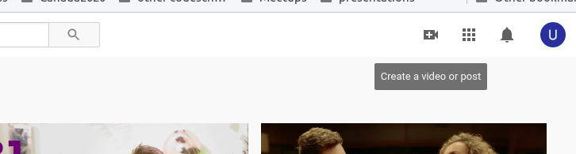
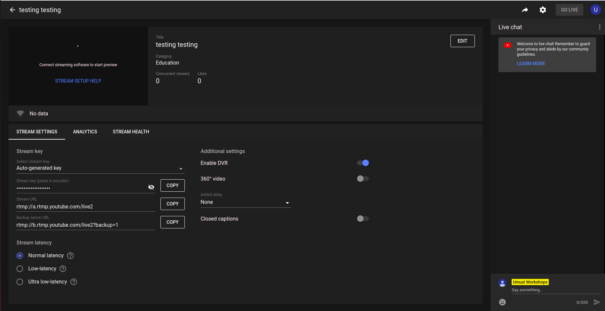
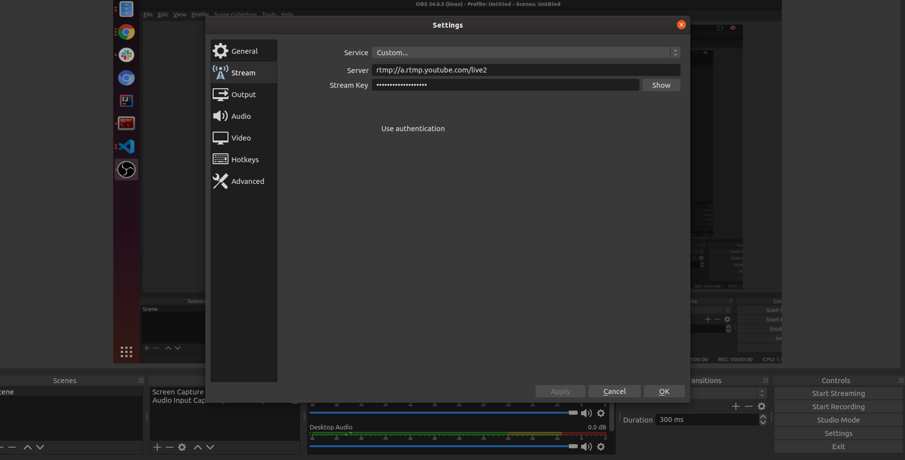

We run a lot of workshops at Umuzi. Here's how to do them well.

### What does success look like?

Basically we want to allow the workshop attendees to interact as much as possible. But sometimes the internet sucks and sometimes there's no electricity. So this process has a few redundancies in it.

Firstly, for a workshop to be sucessful people need to know when it is and how to link to it. So you want to be careful about communication on that point.

Now in the ideal situation, all the recruits can just join a video call and everything will go swimmingly.

But things wont be ideal so we have some redundancies built in. In case the internet is a bit slow we live-stream the workshop to youtube. Youtube live is a bit less data-hungry than a video call so if people are struggling they can go watch and participate there.

And then youtube live records the workshops for us, and that's great because it means that any recruits who missed out, or who want to refer back to something can go watch the video when they want.

### Step 1: Schedule the workshop

Open up google calandar and reserve some time. If you want to include specific people in the workshop take a moment to look at their calandars and check if they are available. We find that if we make our workshops longer than an hour people tend to loose focus.

Add a link to your google hangout or Jitsi meeting. Remember that google hangouts has a user limit of 25.

- https://meet.jit.si/
- https://hangouts.google.com/

### Step 2: Schedule a Youtube live-stream

It's quite likely that you've never done this before. You should have access to a Youtube accout that has streaming turned on. You'll see a little plus button on the top right that allows you to create a video. Click on that and choose to "Go Live".

Click on "Streams" and make a new one. Fill in some stuff about your workshop - most of the fields should make sense.

You can choose to have your stream Private, Public or Unlisted. If you set it to Public then random people from the interwebs WILL show up and make comments about your content. Consider yourself warned. I learned this the hard way.

You can choose to edit your stream and set a date, time and thumbnail. Make the date and time are the same as your calandar event.

Now you'll see a whole lot of weird stuff going on.

Now you are scheduled.

Click on the arrow on the top right and you'll be directed to a page showing all your upcoming video streams. You can get the "Sharable link" for a stream on this page. Explore, you'll find it.

Copy that and paste it onto your google calandar event.

You are scheduled. Cool.

### Step 3: It's workshop time: OBS studio

You should probably try this out before workshop time lest you screw up... It's a little bit involved.

You'll need this: https://obsproject.com/download

Basically, Youtube live doesn't simply let you share your desktop. You have to jump through some hoops to get it right. OBS helps with that.

When you open up OBS and it is set up right, you'll see something... horrible. Ignore most of it, just focus on the controls at the botton of the screen.

You get to tell OBS what you want to capture by adding Sources. Add a source for your screen and for your microphone. You can remove all the others.

In a browser, navigate back to this page:

See those stream settings on the left? Yeah, you'll need those.

In the OBS application, on the right hand side you'll see a settings button. Go there then click on stream. set your service to "Custom" then paste in the stream server and key fro youtube.

Once your settings are saved you can choose to start streaming.

Go stare at Youtube for a while. After a little while a preview will come up that will display your screen with a hell of a lot of lag. Well done. You are connected!

Click the "start Streaming" button when yo want to let people start watching your stream.

##### Hints

I find it useful to open up all the different programs I want to demonstrate before I even open OBS. Get everything else set up, then get the streaming turned on, then join your actual video call.

Also if you are working with multiple screens, I find it's much nicer not to. Either turn one screen off, or set your screens to mirror.

### Step 4

The end. Tell OBS to stop streaming. Then go to youtube and also tell it to stop once the content runs out. And quit your video call.

## Other tools and options

Sometimes it's useful to just draw a picture. Here are a few online whiteboarding tools. Of course nothing beats a real whiteboard, but these might be useful.

- https://app.ziteboard.com/
- https://www.webwhiteboard.com/
- https://whiteboard.explaineverything.com/
- https://whiteboardfox.com/

If you aren't too keen on getting video interaction from people then you can also cut out hangouts/jitsi. If you want your attendees to be able to talk to you with words then Discord is an option, just remember that there will be a lag between what you do on your computer and what tey see in the live stream so it can get a bit hairy.

Or you can also do pure Youtube live streaming and just let the recruits send you text messages. This can get a bit clumsy.
